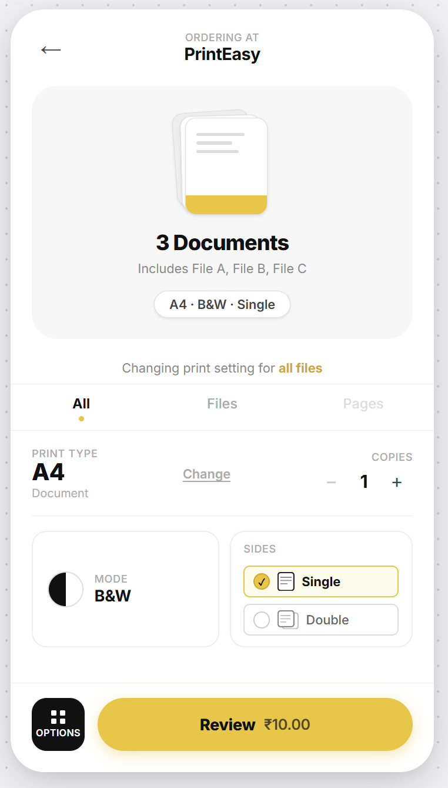
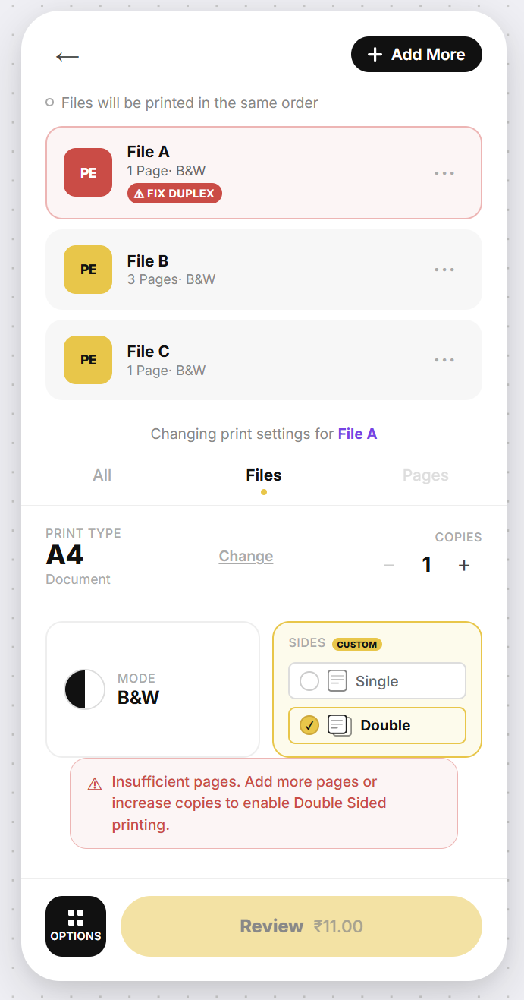
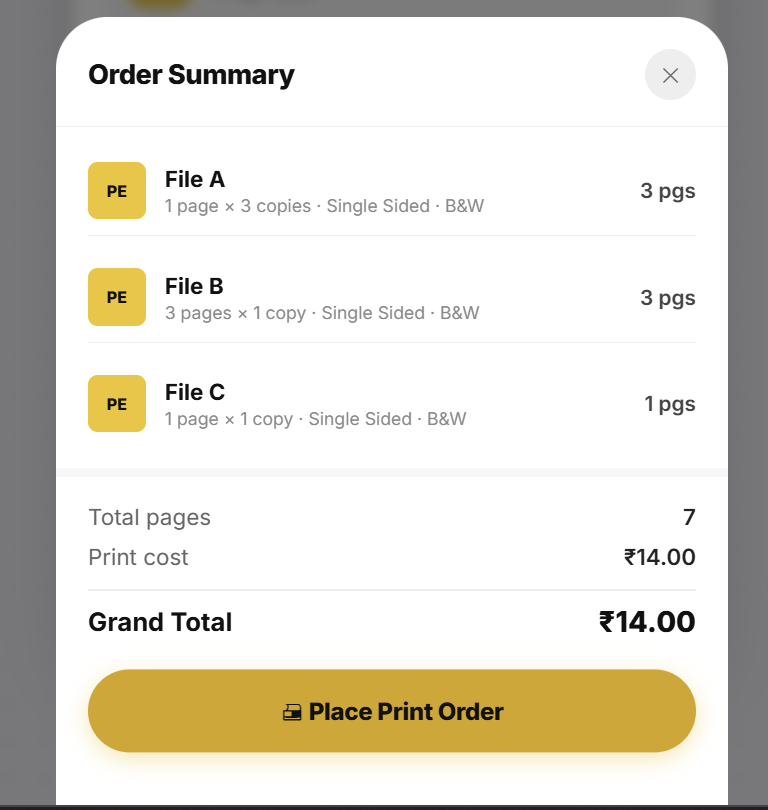

# PrintEasy — Print Configuration Interface

> **Frontend Engineering Assessment** — Next.js Logic & State Management

[](https://nextjs.org)
[](https://react.dev)
[](https://react.dev/reference/react/useReducer)
[](https://redux.js.org)
[](https://vercel.com)

---

## 📸 Screenshots

<table>
  <tr>
    <td align="center">
      
      <br/>
      <b>[All] Tab — Global Config</b>
      <br/>
      <sub>Set copies & sides for all 3 documents at once</sub>
    </td>
    <td align="center">
      
      <br/>
      <b>[Files] Tab — Duplex Validation</b>
      <br/>
      <sub>Rule 2 error shown when pages × copies &lt; 2</sub>
    </td>
    <td align="center">
      
      <br/>
      <b>Order Summary Modal</b>
      <br/>
      <sub>Review modal with per-file breakdown & total</sub>
    </td>
  </tr>
</table>

---

## 🖨 Overview

A single-page **Next.js** print configuration interface where users can apply print settings — **Copies** and **Sides** — either globally to all documents or individually as per-file overrides.

The core engineering challenge is maintaining **property-level override tracking**: global changes must not overwrite local customizations, and the system must validate duplex printing constraints in real time.

---

## ✅ Assignment Compliance

| Requirement | Status | Notes |
|---|---|---|
| Next.js framework | ✅ | v16.2.3, App Router |
| `useReducer` for app state | ✅ | `reducers/printReducer.js` |
| `useContext` for state sharing | ✅ | `context/PrintContext.jsx` |
| `useState` for local UI state | ✅ | Review modal open/close |
| No Redux / Zustand / Recoil | ✅ | Zero external state libraries |
| No external validation libraries | ✅ | Pure JS validation |
| `[All]` tab — global config | ✅ | Propagates to non-overridden files |
| `[Files]` tab — per-file override | ✅ | Property-level `Set` tracking per file |
| **Rule 1** — Property-level overrides | ✅ | Each file has an `overrides: Set<string>` |
| **Rule 2** — Duplex validation | ✅ | `(originalPages × copies) >= 2` |
| Exact error message from spec | ✅ | Defined once in `utils/printUtils.js` |
| Static initial data (File A, B, C) | ✅ | `constants/initialData.js` |
| Mobile responsive | ✅ | Phone-card layout, works on all screens |

---

## 🏗 Architecture

### State Shape

```js
{
  globalSettings: { copies: 1, sides: "single" },
  files: [
    {
      id: "file-a",
      name: "File A",
      originalPages: 1,
      copies: 1,              // effective value
      sides: "single",        // effective value
      overrides: Set(),       // tracks locally overridden properties
      duplexError: false,     // computed validation flag
    },
    // ...
  ],
  activeTab: "all",           // "all" | "files"
  selectedFileId: "file-a",
}
```

### Rule 1 — Property-Level Overrides

Each file tracks a `Set<string>` of property keys that have been locally overridden (e.g. `{ "copies" }`).

When `SET_GLOBAL_COPIES` dispatches, the reducer iterates every file:
- `overrides.has("copies")` → **skip** — preserve the file's local value ✓  
- Otherwise → apply the new global value ✓

This allows a single file to override **one** property while still inheriting the other from global settings.

```
File A: overrides = Set { "copies" }

Global Sides → "double"   →   File A sides  UPDATES  ✓
Global Copies → 3         →   File A copies UNCHANGED ✓  (local override preserved)
```

### Rule 2 — Duplex Validation

```js
// utils/printUtils.js
export const isDuplexValid = (originalPages, copies) =>
  originalPages * copies >= 2;

export const DUPLEX_ERROR_MESSAGE =
  "Insufficient pages. Add more pages or increase copies to enable Double Sided printing.";
```

- Validated inside the reducer on every relevant state dispatch
- Stored as `duplexError: boolean` on each file — no render-time computation
- Error automatically clears when the user resolves the conflict
- Review button is disabled while any file has an active duplex error

---

## 📁 Project Structure

```
PrintEasy/
├── app/
│   ├── layout.js              # Root layout, Inter font, metadata + viewport
│   ├── page.js                # Main page — assembles all components + review modal state
│   └── globals.css            # Complete design system (tokens, components, responsive)
│
├── components/
│   ├── DocumentPreview.jsx    # [All] tab — stacked papers visual + doc count + badge
│   ├── TabBar.jsx             # All | Files | Pages tabs with yellow dot indicator
│   ├── FileList.jsx           # [Files] tab — selectable file cards with badge states
│   ├── ConfigPanel.jsx        # Print Type + Copies | Mode + Sides config section
│   ├── ValidationWarning.jsx  # Duplex error banner (exact message from spec)
│   ├── BottomBar.jsx          # Black Options square + Yellow Review pill
│   └── ReviewModal.jsx        # Animated order summary bottom sheet (bonus UX)
│
├── context/
│   └── PrintContext.jsx       # useReducer + useContext provider
│
├── reducers/
│   └── printReducer.js        # Pure reducer — all actions, Rule 1 + Rule 2 logic
│
├── hooks/
│   └── usePrintConfig.js      # Ergonomic hook — clean dispatchers + derived state
│
├── utils/
│   └── printUtils.js          # isDuplexValid(), DUPLEX_ERROR_MESSAGE constant
│
├── constants/
│   └── initialData.js         # Static seed data: File A (1pg), File B (3pg), File C (1pg)
│
└── assets/
    ├── copies.png             # Screenshot — All tab global config
    ├── fixDuplex.png          # Screenshot — Files tab duplex validation error
    └── order-summary.png      # Screenshot — Review order summary modal
```

---

## 🚀 Getting Started

```bash
# Clone the repository
git clone https://github.com/YOUR_USERNAME/printeasy.git
cd printeasy

# Install dependencies
npm install

# Start development server
npm run dev
# → http://localhost:3000
```

```bash
# Production build
npm run build

# Start production server
npm run start
```

---

## 🧪 Test Scenarios

| # | Action | Expected Result |
|---|---|---|
| 1 | Change global Copies to 3 in **[All]** tab | All 3 files update to 3 copies |
| 2 | Set File A copies to 5 in **[Files]** tab | File A shows 5, badge `Custom` appears |
| 3 | Change global Copies to 2 in **[All]** tab | **File A stays at 5** — override preserved ✓ |
| 4 | Set global Sides to **Double** | File B (3 pages × anything ≥ 1 = ≥ 2) → OK; File A & C (1 page × 1 copy = 1) → Error ✓ |
| 5 | Increase File A copies to 2 in **[Files]** tab | File A duplex error **clears automatically** ✓ |
| 6 | Set File A Sides to Single locally | File A shows `CUSTOM` badge on Sides |
| 7 | Set global Sides to Double again | **File A stays Single** — Sides override preserved ✓ |
| 8 | Any file has active duplex error | **Review button is disabled** ✓ |
| 9 | All errors resolved → click Review | Order summary modal opens with per-file breakdown and price ✓ |

---

## 💡 Design Decisions

**Why `Set<string>` for overrides?**  
A `Set` gives O(1) has-check and semantically models the concept perfectly — it's the set of property names a file has chosen to control locally. Using boolean flags (`copiesOverridden: bool`) would work but doesn't scale to more properties.

**Why store effective values on the file, not derive from global?**  
Storing `file.copies` and `file.sides` directly (updated by the reducer to reflect their effective value) keeps components stateless and dumb — they just read `file.copies`. No need to pass global settings down for value resolution.

**Why is `duplexError` stored in state, not computed in render?**  
Validation is run inside the reducer on every relevant dispatch, keeping state always consistent. If it were computed during render, components would need access to both the file's values AND global settings.

---

## 🛠 Tech Stack

| Layer | Tech | Reason |
|---|---|---|
| Framework | Next.js 16.2.3 (App Router) | Assignment requirement |
| App State | `useReducer` + `useContext` | Assignment requirement — zero external state libs |
| Local State | `useState` | Review modal open/closed |
| Styling | Vanilla CSS + CSS Custom Properties | Full control, no framework dependency |
| Typography | Inter — Google Fonts | Clean, modern, professional |
| Deployment | Vercel | Zero-config Next.js deployment |

---

*Built with ❤️ for the PrintEasy Frontend Engineering Assessment*
